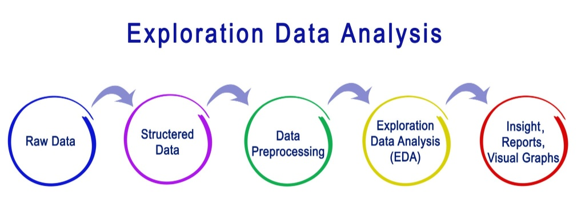
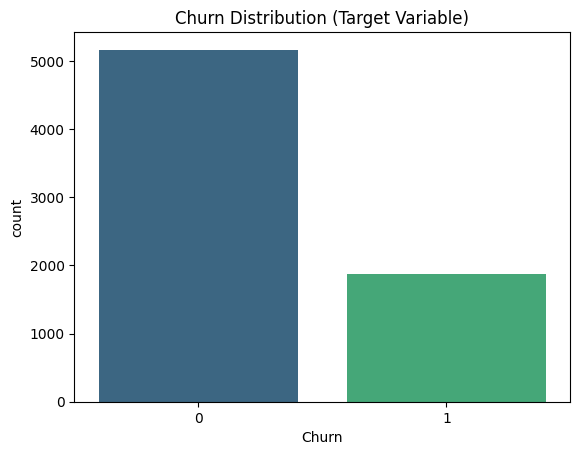
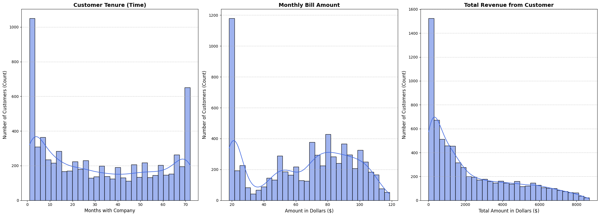
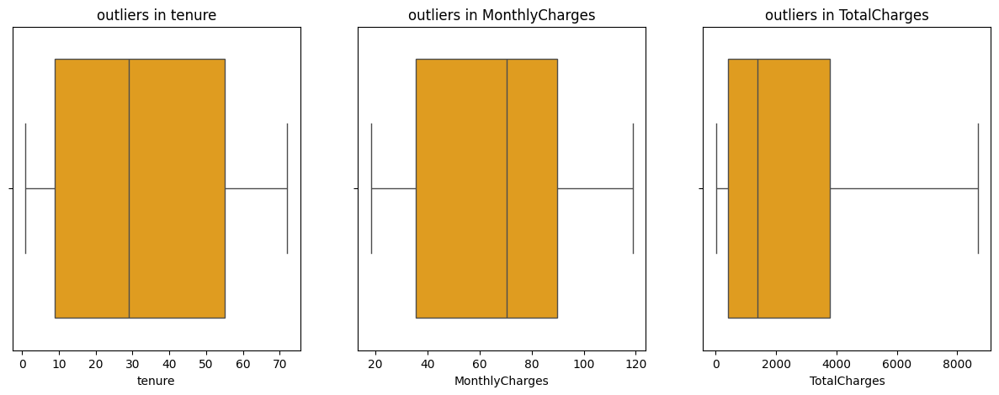
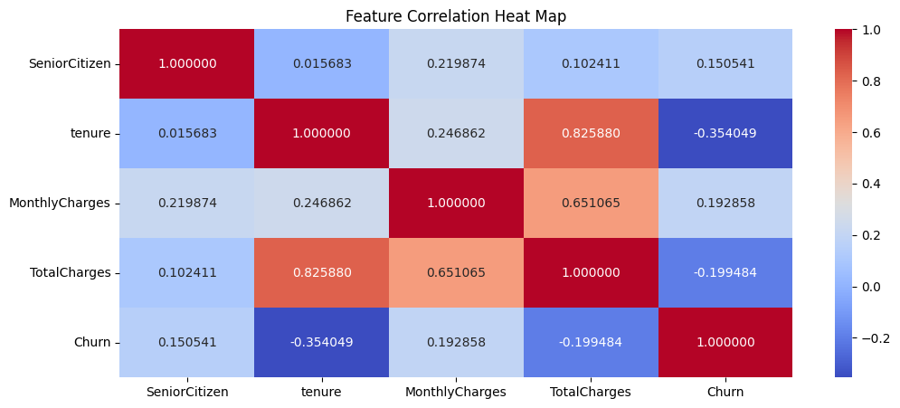

<h1 align="center"> AI-Powered Customer Retention Prediction System</h1>

  
  
  

---

<h2 align="center">📝 Project Overview</h2>
The goal of this project is to use <b>Machine Learning</b> to predict "Customer Churn". Churn happens when a customer stops using a company’s service. By identifying these customers early, a business can take action to keep them, which saves money and increases revenue.

<h2 align="center"> 💼 Business Problem</h2>

* 💰 **Cost Factor:** Acquiring a new customer is 5 times more expensive than keeping an existing one.
* 📉 **Revenue Loss:** When customers leave, it directly impacts the company’s profit and reputation.
* ⚠️ **Challenge:** Companies often fail to see the early signs of a customer being unhappy.

<h2 align="center"> 📂 Data Description</h2>

* 👥 **Demographics:** Gender, Senior Citizen, Partner, and Dependents.
* 🌐 **Services:** Phone service, Internet (DSL/Fiber optic), Online Security, and Streaming.
* 💳 **Account Info:** Tenure, Contract type, and Payment Method.
* 🎯 **Target Variable:** **Churn (Yes/No)** – This is what we want to predict.

---

<h2 align="center"> 🗺️ Project Roadmap</h2>

| Stage | Task | Status |
| :--- | :--- | :--- |
| **Stage 1** | Data Pipeline | ✅ Completed |
| **Stage 2** | Model Development | 🏗️ In Progress |
| **Stage 3** | Explainability (SHAP/LIME) | ⏳ Pending |
| **Stage 4** | Deployment (Streamlit) | ⏳ Pending |

---

<h2 align="center"> ✅ Stage 1: Data Pipeline & Preprocessing</h2>

In this stage, I prepared the raw data for the Machine Learning model. The following steps were taken:

* 🧹 **Handling Missing Values:** I found 11 missing values in the `TotalCharges` column. These rows were removed to ensure data accuracy.
* 🗑️ **Feature Removal:** I dropped the `customerID` column as it does not provide any pattern for predicting churn.
* 🔢 **Categorical Encoding:** Converted text data (Gender, Contract, etc.) into numeric values using **One-Hot Encoding**.
* 📊 **Final Dataset:** The dataset grew from 20 to 31 columns, all in **numeric format**.

<h2 align="center">📊 EDA & Visual Insights</h2>

 <b>Project Flowchart Overview</b>
 
 

* 🟢 **Target Analysis (Churn Distribution):** 

 
  The data is imbalanced. More customers stay (0) than leave (1).

* 🔵 **Numerical Data Distribution:** 

 
  Analyzed the spread of Tenure and Monthly Charges.

* 🟠 **Outlier Detection:** 

 
  Used Boxplots to ensure data quality.

* 🧠 **Feature Correlation (Heatmap):** 

 
  * **Tenure vs. Churn (-0.35):** Longer stay = Lower churn.
  * **Monthly Charges vs. Churn (0.19):** Higher bills = Higher churn risk.

